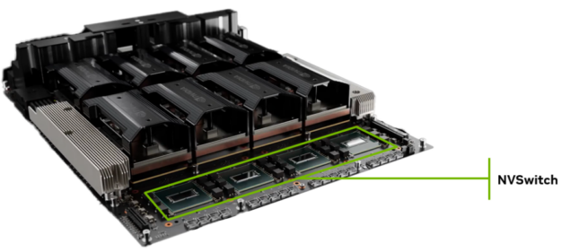
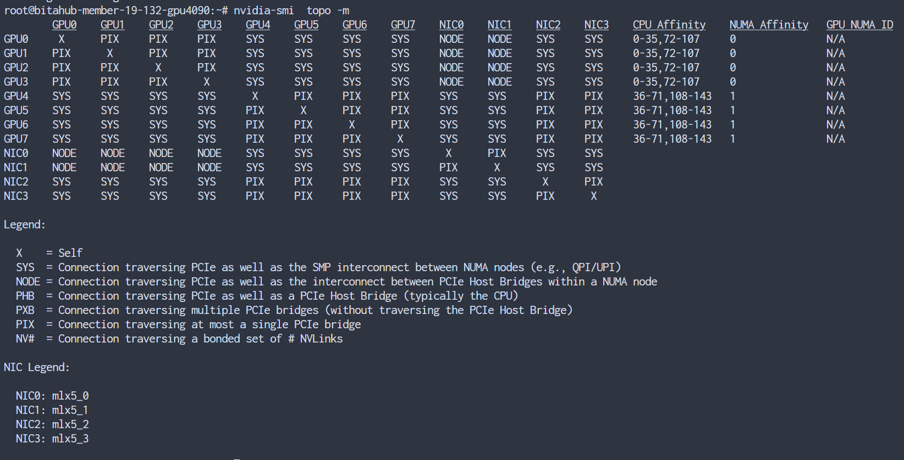
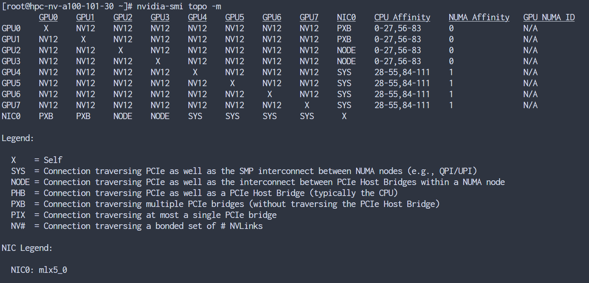
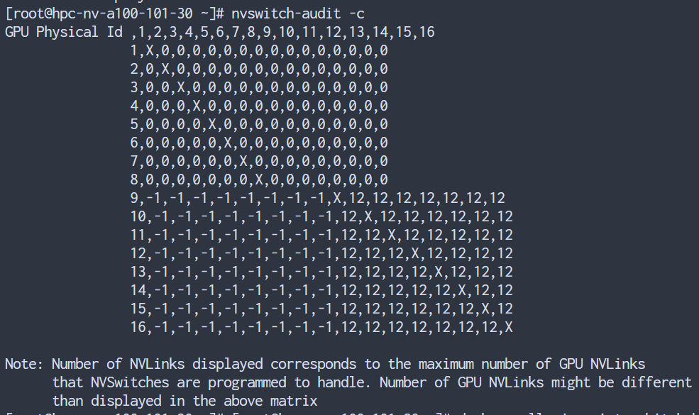
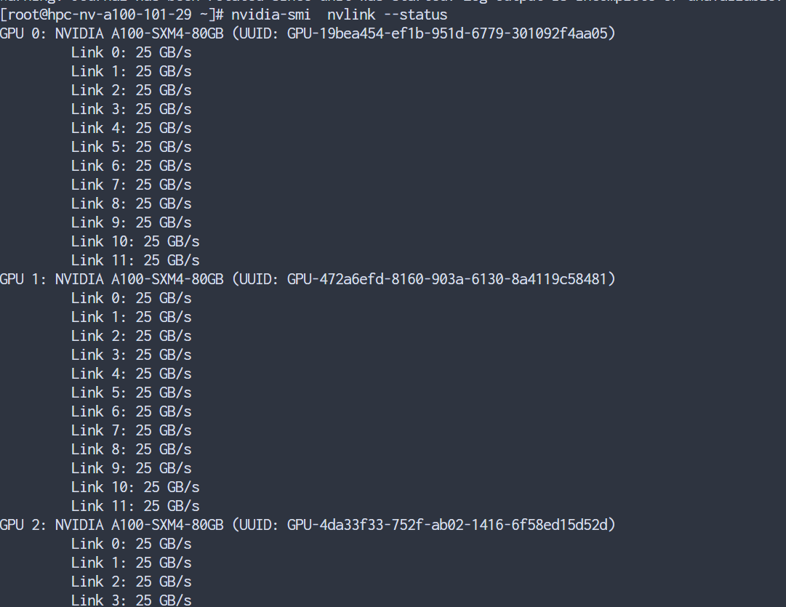

1、SXM是英伟达公司设计出来的，它的出现主要是为高性能计算和数据中心提高更强的计算能力和传输速度。SXM接口的GPU通常是存在于DGX系统板上，该DGX系统板支持4张GPU-SXM或则8张GPU-SXM，而每个GPU之间通过NVLink进行通信。

2、NVIDA GPU-SXM主要是针对英伟达的高端GPU服务器，NVIDA GPU-SXM和NVIDA GPU-PCe这两种卡都能实现服务器的通信，但是实现的方式是不一样的。SXM规格的一般用在英伟达的DGX服务器中，通过主板上集成的NVSwitch实现NVLink的连接，不需要通过主板上的PCle进行通信，它能支持8块GPU卡的互联互通，实现了GPU之间的高带宽。

3.NVIDA GPU-PCle讲解
把PCle GPU卡插到PCIe插槽上，然后和CPU、同一个服务器上其他的GPU卡进行通信，也可以通过网卡与其他的服务器节点上的设备进行通信，这种就是PCle的通信方式，但是这种传输速度不快。如果想要和SXM一样，有很快的传输速度，可以使用NVink桥接器实现GPU和CPU之间的通信，但是和SXM不一样的地方就是它只能实现2块GPU卡之间的通信。

https://x0.ifengimg.com/ucms/2022_51/75FF75E739464CBFD0B1135B53820BF67B205501_size5895_w1250_h703.gif

4.多 GPU TP 推理的工作原理是将每个模型层的计算拆分为服务器中的两个、四个甚至八个 GPU。理论上，两个 GPU 可以将模型的运行速度提升 2 倍，四个 GPU 可以提升 4 倍，八个 GPU 可以提升 8 倍。

但是，每个 GPU 无法独立完成其工作。在每个 GPU 完成模型层各自部分的执行后，每个 GPU 必须将计算结果发送到每个其他 GPU，执行 all-to-all reduction。只有这样，推理执行才能继续到下一个模型层。

[]

​								*四个 NVIDIA NVSwitch 设备的 HGX H200 8-GPU*

为便于比较，假设一台服务器配备 8 个 H200 GPU，但没有使用 NVSwitch，而是使用服务器主板上的点对点连接

4090服务器gpu通信拓扑

a100 nvlink

nvswitch

单台sxm-a100 nvlink状态

V100 (Volta) GPU：每个 GPU 有 **6 条 NVLink**。

A100 (Ampere) GPU：每个 GPU 有 **12 条 NVLink**。

H100 (Hopper) GPU：每个 GPU 继续有 **18 条 NVLink (NVLink 4.0)**。

也就是说，**每一代 GPU NVLink 通道数可能都会增加**，为了实现更多 GPU 的全互联（all-to-all）。

1. **NVSwitch 架构**

   - 在 **DGX A100** 里，有 8 张 A100 GPU，通过 6 颗 NVSwitch 芯片互联。
   - 每个 A100 GPU 有 12 条 NVLink 通道，每条通道带宽是 **25 GB/s/单方向**。
   - 这 12 条通道全部接入 NVSwitch，NVSwitch 再把 GPU ↔ GPU 的互联做全互联交换。

   🔑 所以每个 GPU 的 **12 条 NVLink 并不是全部连到其它 GPU**，而是 **先接到 NVSwitch 芯片**，由 NVSwitch 负责转

1. **带宽核算**
   - 每条 NVLink：25 GB/s × 2（双向） = 50 GB/s。
   - 12 条 NVLink 总带宽：12 × 50 GB/s = **600 GB/s**。
   - 这就是 NVIDIA 宣传的 **A100 GPU ↔ NVSwitch 总带宽 600 GB/s**。

##### 总结：

一个 A100 GPU = 12 条 NVLink 通道。

每条 25 GB/s（单向），总带宽 600 GB/s。

这 12 条线并不是 GPU ↔ GPU 直连，而是 **GPU ↔ NVSwitch**，NVSwitch 再负责做 Fabric 内所有 GPU 的全互联。

**NVLink/NVSwitch 只在节点内有效**

- NVLink / NVSwitch 是板级和机箱级互联，**不能跨机箱**。
- 跨服务器时，NVLink 不再起作用，必须走网络 (IB/RoCE)。

## 🔹 通信路径对比

- **单机**：GPU ↔ NVSwitch ↔ GPU （600 GB/s 双向）
- **跨机**：GPU ↔ NVSwitch ↔ NIC（Infiniband/RoCE网卡） ↔ Infiniband/RoCE 网络 ↔ NIC（Infiniband/RoCE网卡） ↔ NVSwitch ↔ GPU
  - 带宽：200 Gbps ≈ 25 GB/s（远小于 NVSwitch 内部带宽）
  - 延迟：几个微秒，远大于 NVLink（几十纳秒）